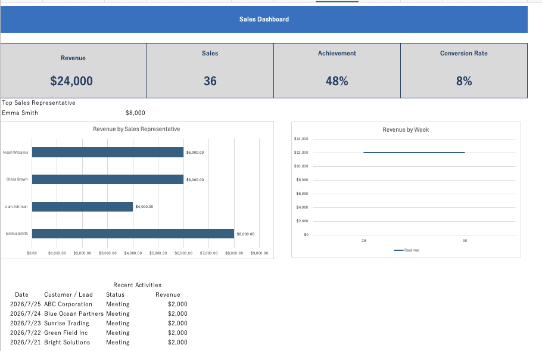
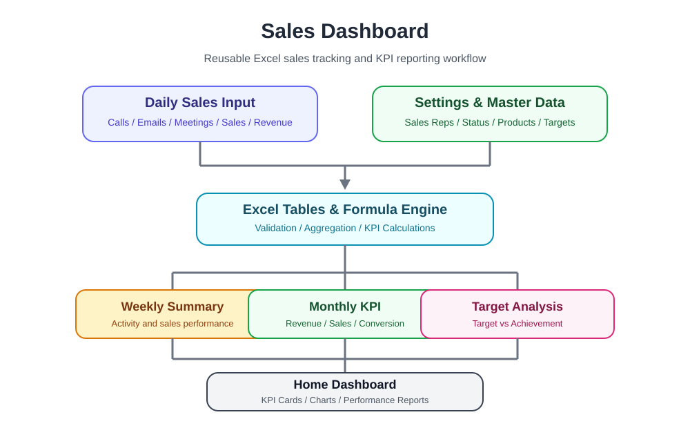

# Sales Dashboard

A reusable, formula-driven Microsoft Excel dashboard for sales tracking, KPI monitoring, and performance analysis.

Designed as a lightweight business reporting solution that transforms daily sales records into management-ready KPIs, summaries, charts, and recent activity views without requiring VBA.



# Sales Dashboard

A reusable, formula-driven Microsoft Excel dashboard for sales tracking, KPI monitoring, and performance analysis.

Designed as a lightweight business reporting solution that transforms daily sales records into management-ready KPIs, summaries, charts, and recent activity views without requiring VBA.


---

## Overview

Sales Dashboard demonstrates how a structured Excel workbook can turn daily operational data into an automatically updated reporting dashboard.

Users enter sales activity into a structured Excel Table, while formulas and dynamic arrays calculate and display:

- Revenue
- Sales volume
- Target achievement
- Conversion rate
- Revenue by sales representative
- Revenue by week
- Recent sales activities
- Top sales representative

The workbook is designed to keep data entry, master data, calculations, and reporting responsibilities separated for easier maintenance and reuse.

---

## Architecture



### Data Flow

```text
Settings / Master Data
          │
          ▼
     Daily Input
          │
          ├──────────────► Summary
          │                   │
          │                   ▼
          │          Sales Rep Analysis
          │
          ├──────────────► Weekly Summary
          │                   │
          │                   ▼
          │           Weekly Revenue
          │
          └─────────────────────────────┐
                                        ▼
                                 Home Dashboard
                                        │
                    ┌───────────────────┼───────────────────┐
                    ▼                   ▼                   ▼
                   KPI               Charts        Recent Activities
```

---

## Features

- Interactive sales dashboard
- KPI cards
- Structured daily sales input
- Revenue tracking
- Sales volume tracking
- Monthly target achievement
- Conversion rate monitoring
- Sales representative performance analysis
- Weekly revenue analysis
- Top sales representative identification
- Latest five sales activities
- Dynamic charts
- Data validation
- Structured Excel Tables
- Formula-driven calculations
- Dynamic array formulas
- Configurable master data and targets
- Reusable workbook structure
- No VBA required

---

## Dashboard KPIs

The Home Dashboard provides four primary KPIs.

| KPI | Description |
| --- | --- |
| Revenue | Total revenue recorded in the sales table |
| Sales | Total number of recorded sales |
| Achievement | Revenue compared with the configured monthly revenue target |
| Conversion Rate | Won opportunities as a percentage of Meeting + Won records |

The dashboard automatically reflects changes made to the underlying sales data.

---

## Dashboard Analytics

### Revenue by Sales Representative

Aggregates revenue for each active sales representative and visualizes individual performance.

This makes it easy to identify top performers and compare contribution to total revenue.

### Revenue by Week

Sales records are grouped by week and summarized into weekly revenue totals.

The weekly chart provides a simple view of revenue movement over time.

### Recent Activities

The dashboard automatically displays the five most recent sales activities.

Displayed fields include:

- Date
- Customer / Lead
- Status
- Revenue

The view is generated dynamically from the sales table and sorted by date.

---

## Workbook Structure

| Sheet | Purpose |
| --- | --- |
| Home Dashboard | Executive KPI and sales performance overview |
| Daily Input | Structured daily sales activity entry |
| Summary | Sales representative performance calculations |
| Weekly Summary | Weekly revenue aggregation |
| Monthly KPI | Monthly KPI reporting area |
| Settings | Master data, targets, and configurable values |

---

## Excel Techniques Used

The workbook demonstrates practical Excel techniques commonly used in business operations and reporting workflows.

### Structured References

Excel Tables are used as the primary data source.

Examples:

```excel
=SUM(tblSales[Revenue])
```

```excel
=SUM(tblSales[Sales])
```

Structured references allow formulas to remain readable and maintainable as sales records change.

### Conditional Aggregation

Representative-level and other conditional calculations use functions such as:

```excel
=SUMIFS(tblSales[Revenue],tblSales[Sales Rep],A2)
```

### Dynamic Arrays

Recent activity reporting uses modern dynamic array functions including:

- TAKE
- SORTBY
- CHOOSECOLS
- UNIQUE
- SORT

Example:

```excel
=TAKE(
    SORTBY(
        CHOOSECOLS(
            tblSales,
            1,
            3,
            5,
            11
        ),
        tblSales[Date],
        -1
    ),
    5
)
```

This retrieves the five most recent activities while displaying only the fields required by the dashboard.

### Lookup Logic

Functions such as `INDEX` and `MATCH` are used for reusable lookup and ranking logic.

Example:

```excel
=INDEX(
    Summary!$A$2:$A$5,
    MATCH(
        MAX(Summary!$B$2:$B$5),
        Summary!$B$2:$B$5,
        0
    )
)
```

This identifies the sales representative with the highest revenue.

---

## Sample Data

The repository includes a sample workbook containing fictional sales data so the dashboard can be reviewed immediately.

Sample records include:

- Fictional sales representatives
- Fictional customers and leads
- Sales activities
- Revenue
- Targets
- Sales statuses
- Weekly reporting data

No real customer or business data is included.

---

## Repository Structure

```text
Sales-Dashboard/
├── images/
│   ├── architecture.svg
│   └── sales-dashboard-overview.png
│
├── sample/
│   └── Sales-Dashboard.xlsx
│
├── src/
│   └── Sales-Dashboard.xlsx
│
├── .gitignore
├── LICENSE
└── README.md
```

### `src`

Contains the working workbook used for development and maintenance.

### `sample`

Contains the portfolio-ready sample workbook with fictional demonstration data.

### `images`

Contains documentation assets used by this README.

---

## How to Use

1. Download the workbook from the `sample` directory.
2. Open `Sales-Dashboard.xlsx` in Microsoft Excel.
3. Review or update master data in the `Settings` sheet.
4. Enter sales activity in the `Daily Input` sheet.
5. Review calculated summaries and KPIs.
6. Open `Home Dashboard` to view the updated reporting dashboard.

---

## Design Principles

This project follows several practical spreadsheet engineering principles:

- Separate input, calculation, configuration, and presentation responsibilities.
- Use structured tables instead of fixed cell ranges where practical.
- Prefer readable formulas and structured references.
- Avoid unnecessary macros and platform-specific automation.
- Keep user input simple while calculations remain automatic.
- Design the workbook so it can be adapted to different sales teams and business workflows.
- Use fictional sample data for safe portfolio demonstration.

---

## Compatibility

Designed for modern versions of Microsoft Excel supporting dynamic array functions such as `TAKE`, `SORTBY`, `CHOOSECOLS`, `UNIQUE`, and `SORT`.

The workbook is designed without VBA dependencies, improving portability between supported Microsoft Excel environments on Windows and macOS.

> Compatibility may vary with older Excel versions that do not support modern dynamic array functions.

---

## Skills Demonstrated

This project demonstrates practical experience with:

- Excel dashboard development
- Business operations reporting
- KPI design
- Data modeling
- Excel Tables
- Structured references
- Dynamic array formulas
- Data validation
- Sales performance analysis
- Reporting workflow design
- Cross-platform spreadsheet design
- Maintainable spreadsheet architecture

---

## License

This project is licensed under the MIT License.

See [LICENSE](LICENSE) for details.
